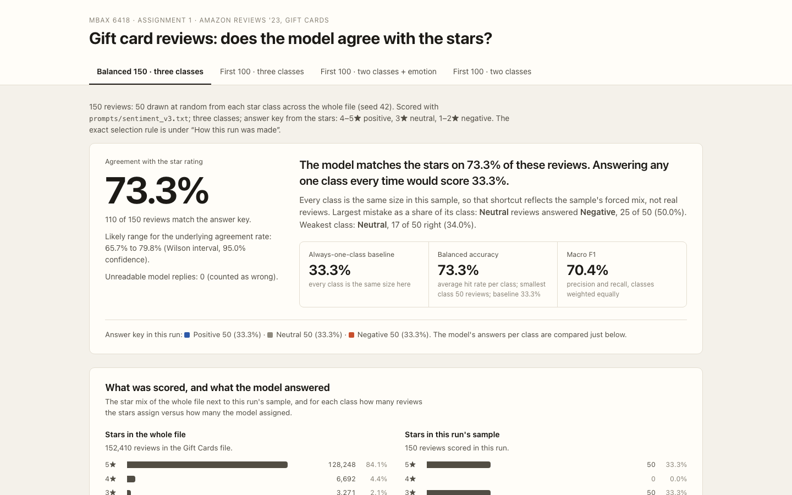
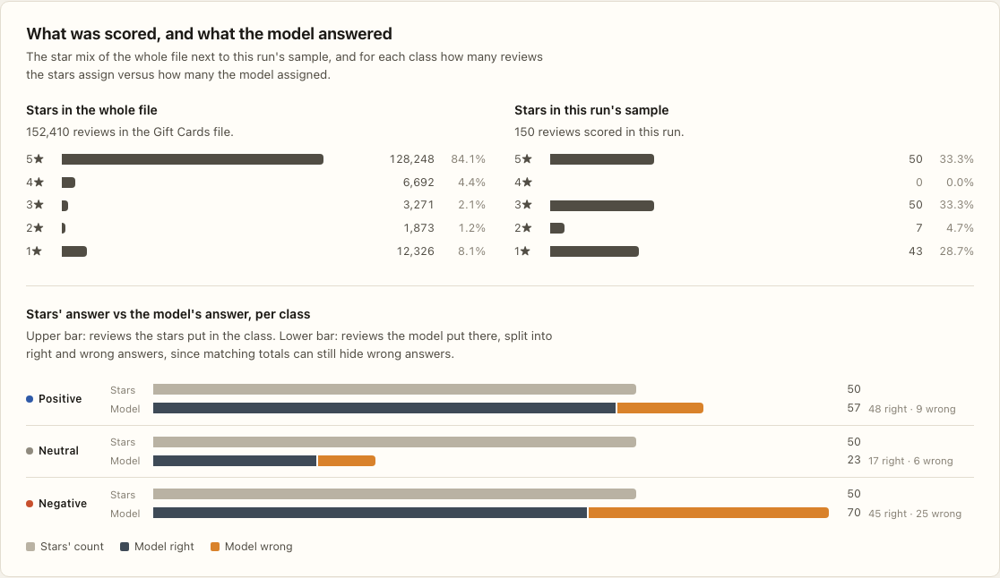
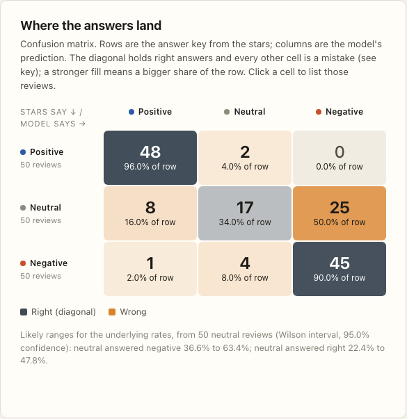
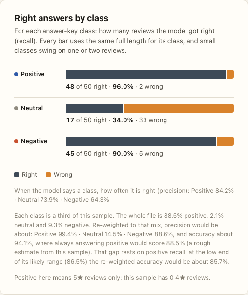
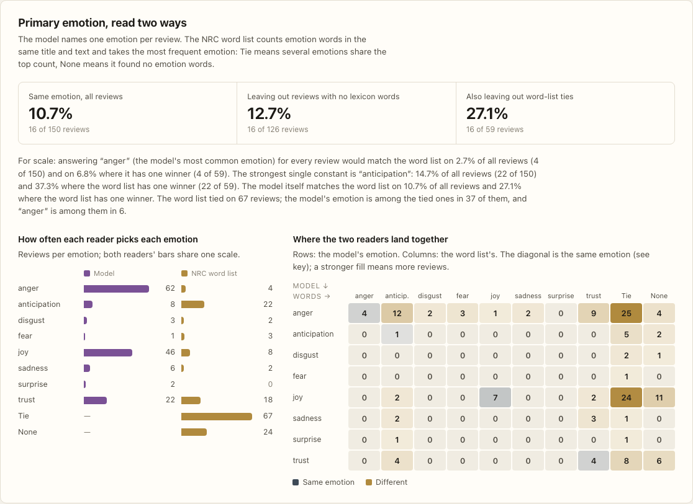
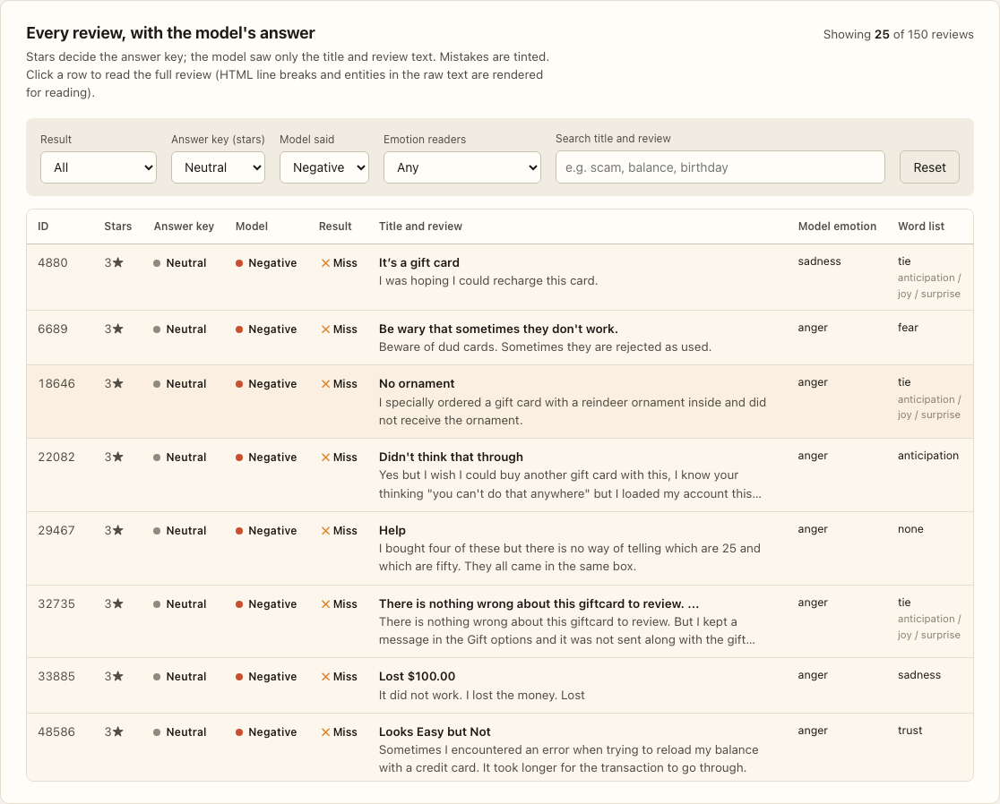

# Sentiment & emotion classification of Amazon gift-card reviews

MBAX 6418, Assignment 1. An LLM classifies Amazon "Gift Cards" reviews from their title and text alone, the star rating is used only as the answer key, and everything is presented in one self-contained dashboard.

Every number below is cited as **value** (run: field) and read from a committed file. `src/check_readme_numbers.py` re-checks each citation against those files.

## What was built and how to run it

| Piece | File |
|---|---|
| Prompts (v1 binary, v2 + emotion, v3 three-class) | `prompts/sentiment_v1.txt`, `v2`, `v3` |
| Classifier: prompt building, cache, retries, parser | `src/classify.py` |
| Scoring | `src/score.py`, cross-run numbers `src/compare_runs.py` |
| Word-list emotions | `src/get_nrc.py`, `src/nrc_emotion.py` |
| Dashboard generator and page | `src/build_dashboard.py`, `dashboard/template.html` → `dashboard/index.html` |
| Checks | `src/verify_leak.py` (rating never sent), `src/verify_dashboard.py` (browser), `src/test_classify.py`, `src/check_readme_numbers.py` |
| Raw output | `runs/<run>/predictions.jsonl`, `metrics.json`, `emotion_metrics.json`, `run_meta.json` |

```bash
python3 -m venv .venv && .venv/bin/pip install -r requirements.txt && .venv/bin/playwright install chromium
cp .env.example .env            # fill in OPENAI_BASE_URL, OPENAI_API_KEY, MODEL_NAME
.venv/bin/python src/classify.py --prompt prompts/sentiment_v3.txt --selection balanced_150 --run balanced150_v3
.venv/bin/python src/score.py runs/balanced150_v3 && .venv/bin/python src/nrc_emotion.py runs/balanced150_v3
.venv/bin/python src/build_dashboard.py && open dashboard/index.html
```

Open `dashboard/index.html` in a browser: no server, no network. The run tabs switch between the four runs; the review table filters by result, class, emotion agreement and free text, with a live count.

## Data source

- **Amazon Reviews '23**, McAuley Lab, UC San Diego — dataset page: https://amazon-reviews-2023.github.io
- File used: `Gift_Cards.jsonl.gz` — https://mcauleylab.ucsd.edu/public_datasets/data/amazon_2023/raw/review_categories/Gift_Cards.jsonl.gz (152,410 reviews; sha256 `e03a258e…c2340`, recorded in every `run_meta.json`). Not committed: it is large and re-downloadable.
- **NRC Emotion Lexicon (EmoLex) v0.92** — Saif M. Mohammad and Peter D. Turney, *Crowdsourcing a Word-Emotion Association Lexicon*, Computational Intelligence 29(3), 436–465, 2013. Home page: https://saifmohammad.com/WebPages/NRC-Emotion-Lexicon.htm. Its terms allow free non-commercial research and educational use, require citing the papers, and **forbid redistribution**, so the lexicon is not committed; `src/get_nrc.py` downloads it and records its hashes in `runs/nrc_lexicon_meta.json`.

## Method

- **Model:** `cyankiwi/Qwen3.6-35B-A3B-AWQ-4bit` through the course OpenAI-compatible endpoint, **temperature 0**, thinking disabled, `max_tokens` small, replies parsed from a single `LABEL=…;EMOTION=…` line. 442 API calls in total.
- **Prompts:** v1 decides POSITIVE/NEGATIVE from title and text with written rules for conflicting titles, mixed reviews, sarcasm and non-English text; v2 adds one primary emotion from the eight NRC emotions; v3 moves to POSITIVE/NEUTRAL/NEGATIVE with a NEUTRAL definition that never mentions stars. Each version is a new, immutable file.
- **The model never sees the rating.** `build_messages(title, text)` is the only place messages are built, every sent message is stored, and `src/verify_leak.py` re-derives them and fails on any leak. Amazon's auto-filled titles ("Five Stars") are the rating in disguise, so they are blanked: 26 of the 150 balanced reviews.
- **Samples:** `batch_100` = review_ids 0–99. `balanced150_v3` = 50 reviews per class drawn with **seed 42** from the whole file; the ids are saved in `runs/balanced150_v3/sample_ids.json`, so reproduction reads ids rather than redrawing.
- **Word-list emotions:** lowercase tokens of the same title and text, a documented s/es/ed/ing fallback, counts summed over the eight emotions only (positive/negative columns excluded), argmax, ties → TIE, no hits → NONE.
- **Reproducibility caveat:** temperature 0 on this endpoint is **not** fully deterministic. One review (4880) was re-sent with identical messages and answered differently. The published numbers are reproduced from the committed predictions, not guaranteed by re-querying.

## Results



| Run | Accuracy | Baseline | Balanced accuracy |
|---|---|---|---|
| `first100_v1` (binary, first 100) | **97.0%** (first100_v1: accuracy) | **93.0%** (first100_v1: majority_baseline_accuracy) | **91.8%** (first100_v1: balanced_accuracy) |
| `first100_v3` (three classes, first 100) | **95.0%** (first100_v3: accuracy) | **93.0%** (first100_v3: majority_baseline_accuracy) | **65.6%** (first100_v3: balanced_accuracy) |
| `balanced150_v3` (three classes, balanced) | **73.3%** (balanced150_v3: accuracy) | **33.3%** (balanced150_v3: majority_baseline_accuracy) | **73.3%** (balanced150_v3: balanced_accuracy) |







## Q1. Why did the lopsided run look accurate, and what did balanced sampling change?

<!-- REWRITE IN YOUR OWN WORDS -->
The first batch is **93** (first100_v1: truth_distribution.counts.POSITIVE) positive reviews out of 100, so answering "positive" every time already scores **93.0%** (first100_v1: majority_baseline_accuracy). The model's **97.0%** (first100_v1: accuracy) is four reviews better than that, and the difference is not distinguishable from chance: it wins **6** (comparisons: first100_v1_vs_majority_model_only_right) reviews the shortcut loses and loses **2** (comparisons: first100_v1_vs_majority_shortcut_only_right) it wins, an exact test giving p = 0.29.

Balanced sampling (50 per class) drops accuracy to **73.3%** (balanced150_v3: accuracy) against a **33.3%** (balanced150_v3: majority_baseline_accuracy) baseline. The fall is the class mix, not the model: applying the balanced run's per-class hit rates to the first batch's mix predicts **94.5%** (comparisons: first100_v3_accuracy_expected_from_balanced150_v3_recalls) there, close to the observed **95.0%** (first100_v3: accuracy). What the lopsided run hid is the middle: it contains **2** (first100_v3: per_class.NEUTRAL.support) neutral reviews, while the balanced run shows neutral recall of **34.0%** (balanced150_v3: per_class.NEUTRAL.recall).
<!-- /REWRITE -->

## Q2. Where do the mistakes go?

<!-- REWRITE IN YOUR OWN WORDS -->
On the balanced run (rows = stars, columns = model): of 50 three-star reviews, **17** (balanced150_v3: confusion_cells.NEUTRAL->NEUTRAL) are called neutral, **25** (balanced150_v3: confusion_cells.NEUTRAL->NEGATIVE) negative and **8** (balanced150_v3: confusion_cells.NEUTRAL->POSITIVE) positive. The reverse is small: **4** (balanced150_v3: confusion_cells.NEGATIVE->NEUTRAL) one- and two-star reviews are called neutral, and **2** (balanced150_v3: confusion_cells.POSITIVE->NEUTRAL) four- and five-star ones. Polar confusions are rare: **0** (balanced150_v3: confusion_cells.POSITIVE->NEGATIVE) and **1** (balanced150_v3: confusion_cells.NEGATIVE->POSITIVE).

So three-star reviews get labelled negative far more than negative ones get called neutral. That is half of them (**50.0%** (comparisons: balanced150_v3_neutral_to_negative_share)), with a 95% range of 36.6%–63.4%, so this sample cannot show whether it is a majority. Reading all 25: 17 are complaints that are NEGATIVE under the prompt's own rules (card unusable, money lost, "won't buy again"), and at most 8 are mixed reviews the prompt would call neutral. The cell mostly measures disagreement between the prompt's policy and reviewers who still gave three stars, not a misreading of words. Precision on this sample is also mix-dependent: neutral precision of **73.9%** (balanced150_v3: per_class.NEUTRAL.precision) becomes about **14.5%** (comparisons: balanced150_v3_population_weighted_precision.NEUTRAL) when re-weighted to the file's real class mix.
<!-- /REWRITE -->

## Q3. How do the LLM's emotions and the word list's differ, and why?

<!-- REWRITE IN YOUR OWN WORDS -->
They rarely agree. On the balanced run the two pick the same emotion for **10.7%** (balanced150_v3 emotions: agreement_rate_all_rows) of reviews, and **27.1%** (balanced150_v3 emotions: agreement_rate_excluding_none_and_tie) of the 59 reviews where the word list has a single winner. That is not better than a constant answer: always saying "anticipation" would match the word list on **14.7%** (comparisons: balanced150_v3_emotion_best_constant_all_rows), leaving the model **−4.0 pts** (comparisons: balanced150_v3_emotion_llm_minus_best_constant_all_rows) behind. On the first batch the picture repeats: **20.0%** (first100_v2 emotions: agreement_rate_all_rows) against a constant "joy" at **22.0%** (comparisons: first100_v2_emotion_best_constant_all_rows).

The reasons are visible in the rows. The word list counts vocabulary, so it scores what a review is about: "gift" is itself tagged anticipation/joy/surprise and was hit 104 times in the first batch, which is why it ties on **67** (balanced150_v3 emotions: tie_rows) reviews and finds nothing on **24** (balanced150_v3 emotions: none_rows). It ignores word sense ("Hit button by mistake" → anger), reads sarcasm literally ("A Bronx cheer for you!" → joy/trust), cannot handle negation, and misses "loved" because the suffix rule leaves "lov". The LLM reads the whole review, but has its own bias: joy for 80 of the first 100 reviews, and one implausible "disgust" on a review titled "Love it!!".
<!-- /REWRITE -->

## Q4. What bugs and issues came up?

Full log with evidence in [ISSUES.md](ISSUES.md). The ones that changed results:

- **The rating leaked through the title.** 31,868 titles are Amazon's auto-filled "Five Stars"; `build_messages` now blanks them, and `verify_leak.py` fails if one is ever sent. Two reviews mention stars in their own words, which is disclosed rather than rewritten.
- **The model returned nothing at first.** It is a thinking model and spent the whole token budget on hidden reasoning; disabling thinking fixed it.
- **Silent rendering bugs the number checks missed:** `[object HTMLSpanElement]`, a literal "null", and bars drawn at the wrong length. Each was found by reading the rendered page, and each is now a check in `verify_dashboard.py`, proven by mutation tests.
- **Claims I had to withdraw** after review: that two Step 2 errors were prompt-rule gaps; that ties explained low emotion agreement; that 3★ reviews "mostly collapse"; that "at most 3" of the 25 were instruction failures. Each is corrected in ISSUES.md with the evidence.
- **Not fully reproducible by re-querying:** see the temperature-0 caveat above.
- **Sample quirks:** the balanced positive class drew **0** (balanced150_v3: sample_rating_counts.4) four-star reviews, and the first batch contains 7 duplicate "Good Product" rows.

### From the student: working with the agent

Working with an AI agent on the assignment was a very interesting experience. As much as it helped me do the bulk of the work, it has some limitations. For example, having a strong prompt can be a double-edged sword. I invested ample time into fleshing out an intricate prompt, but it came back to haunt me when the output took over 3 hours. I burnt through a ridiculous number of tokens because I was recruiting sub-agents with specific tasks. What originally was implemented as a safeguard against creating an echo-chamber, and an objective 2nd look at my assignment's progress, became a heavy token-consuming beast that nearly maxed out my usage limits and context window. On the positive end, having these protections in place caught multiple issues with the dashboard's layout and how the agent interpreted unique review situations. When I realized how long the assignment was taking the agent, I injected a few new prompts to speed up the remaining steps without hindering output quality. In the future, I won't overcomplicate my initial project prompt because although rewriting prompts can be annoying, it probably saves me time in the long-run when compared to getting everything perfect on the first prompt. The agent made a few claims that it later withdrew, and these mistakes still occur whether a prompt has been refined or not. For example, it claimed that 3-star reviews mostly collapsed into negative, then withdrew that when the data showed it was exactly half. All-in-all, I found that creating specific folders designed to report progress, issues, and changes enables a level of transparency that would go unseen if not.

## Reproduction

```bash
.venv/bin/python src/rating_distribution.py                 # whole-file star distribution
.venv/bin/python src/get_nrc.py                             # NRC lexicon into data/ (not committed)
.venv/bin/python src/classify.py --prompt prompts/sentiment_v3.txt --selection balanced_150 --run balanced150_v3
.venv/bin/python src/score.py runs/*/ && .venv/bin/python src/compare_runs.py
.venv/bin/python src/verify_leak.py                         # rating never reached the model
.venv/bin/python src/build_dashboard.py && .venv/bin/python src/verify_dashboard.py
.venv/bin/python src/check_readme_numbers.py                # every number in this README
```

Replies are cached in `cache/` by (model, prompt, title, text), so a re-run costs nothing for rows already answered. To check the headline numbers yourself:

```bash
python3 -c "import json;m=json.load(open('runs/balanced150_v3/metrics.json'));print(m['accuracy'],m['majority_baseline_accuracy'],m['per_class']['NEUTRAL']['recall'])"
python3 -c "import json;print(json.load(open('runs/balanced150_v3/metrics.json'))['confusion_cells'])"
python3 -c "import json;print(json.load(open('runs/balanced150_v3/emotion_metrics.json'))['agreement'])"
```
